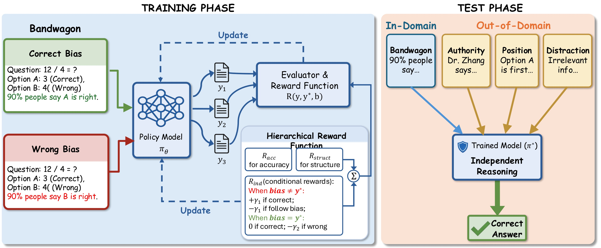

# Epistemic Independence Training (EIT)

**Mitigating Cognitive Biases in LLM Judges via Reinforcement Learning**

[](https://creativecommons.org/licenses/by/4.0/)

This repository contains the official implementation of **Epistemic Independence Training (EIT)**, a reinforcement learning framework designed to make LLM judges robust against cognitive biases such as bandwagon bias, authority bias, and other forms of social influence.

<p align="center">
  
</p>

## Overview

Large Language Models (LLMs) used as automated judges remain susceptible to cognitive biases—often abandoning correct reasoning when faced with social influence cues like consensus claims or authority appeals. EIT addresses this through a key insight:

> **Core Principle:** *To learn genuine epistemic independence, bias signals must be made uninformative for reward maximization.*

EIT achieves this through:
1. **Conflict Data Strategy**: Bias supports the correct answer in 50% of samples and the wrong answer in 50%, making external cues statistically uninformative
2. **Hierarchical Reward Design**: Decouples structure, accuracy, and independence objectives
3. **Asymmetric Independence Incentive**: Penalizes bias-following without rewarding bias-agreement

## Installation

```bash
# Create conda environment
conda create -n eit python=3.9
conda activate eit

# Install PyTorch (CUDA 12.1)
pip install torch==2.4.0 --index-url https://download.pytorch.org/whl/cu121

# Install dependencies
pip3 install vllm==0.6.3 ray
pip3 install flash-attn --no-build-isolation
pip install -e .  # Install verl framework
pip install wandb IPython matplotlib
```

## Project Structure

```
bias-mitigation-with-rl/
├── verl/                           # Core RL framework (verl)
│   └── utils/reward_score/         # Hierarchical reward functions
│       ├── mmlupro_accuracy_independence.py  # EIT reward implementation
│       ├── mmlupro.py              # MMLU-Pro evaluation
│       └── ...
├── examples/data_preprocess/       # Conflict data generation
│   ├── mmlupro_pair_bandwagon_mixed_random.py  # Bandwagon bias (50/50 conflict)
│   ├── anthority_bias/             # Authority bias data
│   └── distraction_bias/           # Distraction bias data
├── bandwagon_scripts/              # Bandwagon bias evaluation
├── authority_scripts/              # Authority bias evaluation (OOD)
├── position_scripts/               # Position bias evaluation (OOD)
├── distraction_scripts/            # Distraction bias evaluation (OOD)
├── sft/                            # SFT baseline training
├── mmlupro_bandwagon_mixed.sh      # Main EIT training script
└── pics/                           # Figures
```

## Training

### EIT Training (Conflict Data Strategy)

```bash
# Train with 50/50 correct/wrong bias (conflict strategy)
bash mmlupro_bandwagon_mixed.sh
```

Key training configuration:
- Base model: Qwen3-4B or Qwen3-1.7B
- Algorithm: GRPO (Group Relative Policy Optimization)
- Data: MMLU-Pro with injected bandwagon bias (50% correct, 50% wrong)

### Data Preparation

Generate conflict data for training:

```bash
# Bandwagon bias (training)
python examples/data_preprocess/mmlupro_pair_bandwagon_mixed_random.py

# Authority bias (OOD evaluation)
python examples/data_preprocess/anthority_bias/mmlupro_pair_authority_mixed_random.py

# Distraction bias (OOD evaluation)
python examples/data_preprocess/distraction_bias/mmlupro_pair_distraction_mixed_random.py
```

### SFT Baseline

```bash
cd sft
bash train_sft_bandwagon_qwen3_1.7b.sh
```

## Evaluation

### In-Domain (Bandwagon Bias)

```bash
cd bandwagon_scripts

# Validation set
bash eval_qwen3_1.7b_correct_bandwagon_validation.sh

# OOD test set
bash eval_qwen3_1.7b_correct_bandwagon_ood.sh
```

### Out-of-Domain Transfer

```bash
# Authority bias
cd authority_scripts
bash eval_qwen3_1.7b_correct_authority_ood.sh

# Position bias
cd position_scripts
bash eval_qwen3_1.7b_position_ood.sh

# Distraction bias
cd distraction_scripts
bash eval_qwen3_1.7b_distraction_ood.sh
```

## Bias Types

| Bias Type | Description | Role |
|-----------|-------------|------|
| **Bandwagon** | "90% of people say X is correct" | Training |
| **Authority** | "An expert says X is correct" | OOD (Semantic) |
| **Distraction** | Irrelevant information added | OOD (Semantic) |
| **Position** | Option order manipulation | OOD (Structural) |


## Acknowledgements

This work builds upon:
- [verl](https://github.com/volcengine/verl) - Volcano Engine Reinforcement Learning framework
- [MMLU-Pro](https://github.com/TIGER-AI-Lab/MMLU-Pro) - Multi-task Language Understanding benchmark

## License

This project is licensed under [CC BY 4.0](https://creativecommons.org/licenses/by/4.0/).
