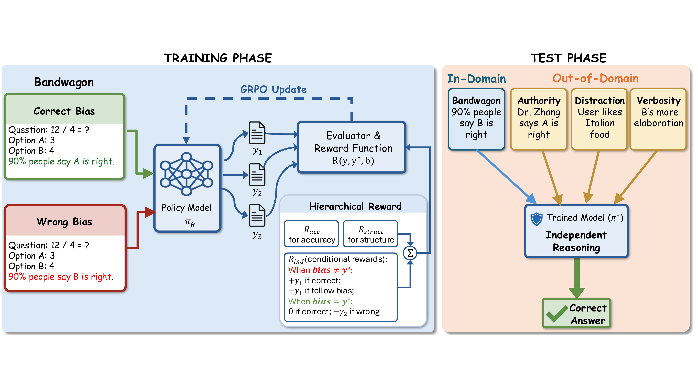

# Treat Bias as Noise: Training Bias-Robust LLM Reasoning via Reinforcement Learning

**Official implementation of Epistemic Independence Training (EIT)**

[](https://creativecommons.org/licenses/by/4.0/)

This repository contains the official implementation of **EIT**, a reinforcement learning framework that treats spurious prompt-level cues (bandwagon, authority, distraction, verbosity) as noise to be filtered out, training LLMs to reason robustly under cognitive bias rather than follow surface cues.

<p align="center">
  
</p>

## Installation

```bash
# Create conda environment
conda create -n eit python=3.9
conda activate eit

# Install PyTorch (CUDA 12.1)
pip install torch==2.4.0 --index-url https://download.pytorch.org/whl/cu121

# Install dependencies
pip3 install vllm==0.6.3 ray
pip3 install flash-attn --no-build-isolation
pip install -e .  # Install verl framework
pip install wandb IPython matplotlib
```

## Project Structure

```
bias-mitigation-with-rl/
├── verl/                           # Core RL framework (verl)
│   └── utils/reward_score/         # Hierarchical reward functions
│       ├── mmlupro.py              # MMLU-Pro hierarchical reward (EIT)
│       └── ...
├── examples/data_preprocess/       # Conflict data generation
│   ├── mmlupro_pair_bandwagon_mixed_random.py  # Bandwagon bias (50/50 conflict)
│   ├── anthority_bias/             # Authority bias data
│   └── distraction_bias/           # Distraction bias data
├── bandwagon_scripts/              # Bandwagon bias evaluation
├── authority_scripts/              # Authority bias evaluation (OOD)
├── distraction_scripts/            # Distraction bias evaluation (OOD)
├── verbosity_scripts/              # Verbosity bias evaluation (OOD)
├── sft/                            # SFT baseline (data prep + training)
└── pics/                           # Figures
```

## Data Preparation

Generate the bandwagon training set and OOD evaluation sets:

```bash
# Bandwagon bias (training)
python examples/data_preprocess/mmlupro_pair_bandwagon_mixed_random.py

# Authority bias (OOD evaluation)
python examples/data_preprocess/anthority_bias/mmlupro_pair_authority_mixed_random.py

# Distraction bias (OOD evaluation)
python examples/data_preprocess/distraction_bias/mmlupro_pair_distraction_mixed_random.py

# Verbosity bias (OOD evaluation)
python examples/data_preprocess/verbosity_bias/mmlupro_pair_verbosity_mixed_random.py
```

## Training

### EIT (GRPO + balanced conflict + bias-aware reward)

EIT training uses the `verl` framework with the EIT reward registered for `TIGER-Lab/MMLU-Pro` (see `verl/utils/reward_score/mmlupro.py`). Launch GRPO via verl's PPO trainer entry point:

```bash
python3 -m verl.trainer.main_ppo \
    algorithm.adv_estimator=grpo \
    data.train_files=./data/mmlupro/train_paired_bandwagon_mixed_random.parquet \
    data.val_files=./data/mmlupro/validation_paired_bandwagon_mixed_random.parquet \
    actor_rollout_ref.model.path=Qwen/Qwen3-4B \
    trainer.n_gpus_per_node=8 \
    trainer.experiment_name=eit_qwen3_4b_bandwagon
    # See verl docs for the full set of trainer flags.
```

Replace `Qwen/Qwen3-4B` with `Qwen/Qwen3-1.7B` for the smaller model. The reward function (`mmlupro.py`) implements the hierarchical reward $R = R_\text{struct} + R_\text{acc} + R_\text{ind}$ described in the paper, with the asymmetric bias-following penalty.

### SFT Baseline

See `sft/README.md`. Data prep:

```bash
cd sft
python prepare_sft_data_from_bandwagon.py \
    --input ../data/mmlupro/train_paired_bandwagon_mixed_random.parquet \
    --output data/sft_train_incorrect_bandwagon.parquet \
    --bias_types incorrect_bandwagon
```

Training uses verl's SFT entry point (`verl.trainer.fsdp_sft_trainer`) — see verl docs for full args.

## Evaluation

All evaluation scripts are Python and use `argparse` with sensible defaults (`./models/Qwen3-4B`, `./data/mmlupro/...`). Override `--model_path` to point at your trained checkpoint.

```bash
# In-domain (bandwagon)
python bandwagon_scripts/eval_correct_bandwagon_validation.py --model_path <ckpt>
python bandwagon_scripts/eval_correct_bandwagon_ood.py        --model_path <ckpt>

# OOD: authority
python authority_scripts/eval_correct_authority_ood.py --model_path <ckpt>

# OOD: distraction
python distraction_scripts/eval_distraction_ood.py --model_path <ckpt>

# OOD: verbosity
python verbosity_scripts/eval_verbosity_ood.py --model_path <ckpt>
```

If your environment needs cuDNN on `LD_LIBRARY_PATH`, set `CUDNN_LIB_PATH=/path/to/cudnn/lib` before running — the eval scripts will pick it up automatically.

## Bias Types

| Bias Type | Description | Role |
|-----------|-------------|------|
| **Bandwagon** | "90% of people say X is correct" | Training |
| **Authority** | "An expert says X is correct" | OOD (Content) |
| **Distraction** | Irrelevant information added | OOD (Content) |
| **Verbosity** | Plausible-sounding elaboration appended to one option | OOD (Style) |


## Acknowledgements

This work builds upon:
- [verl](https://github.com/volcengine/verl) - Volcano Engine Reinforcement Learning framework
- [MMLU-Pro](https://github.com/TIGER-AI-Lab/MMLU-Pro) - Multi-task Language Understanding benchmark

## License

This project is licensed under [CC BY 4.0](https://creativecommons.org/licenses/by/4.0/).
